# System-Assigned Managed Identity Implementation Guide

## 🎯 Overview

The RAG Framework has been successfully updated to use **System-Assigned Managed Identity (SAMI)** as the primary authentication method for Azure services, with API key fallback for development and compatibility.

## ✅ What's Been Implemented

### 1. **Updated Retrieval Class** (`rag_shared/utils/retrieval.py`)
- **Primary**: System-Assigned Managed Identity authentication
- **Fallback**: API key authentication
- **Services**: Azure AI Search, Azure OpenAI (Embeddings & Chat)
- **Logging**: Clear indicators of which authentication method is used

### 2. **Updated Configuration Classes** (`rag_shared/utils/config_dataclasses.py`)
- Added `use_managed_identity` flag to:
  - `LLMConfig` 
  - `EmbeddingModelConfig`
  - `AiSearchConfig`
- Default: `true` (managed identity enabled)
- Updated metadata fields to match transcript schema

### 3. **Updated Configuration** (`resources/configs/handbook_config.yml`)
- Enabled managed identity for all Azure services
- API keys marked as fallback only
- Comments clarify the authentication strategy

## 🔒 Security Benefits

1. **🛡️ No API Keys in Code**: Credentials never stored in configuration or code
2. **🔄 Automatic Token Refresh**: Azure handles token lifecycle
3. **📋 Audit Trail**: All access logged through Azure AD
4. **🎯 Least Privilege**: Fine-grained RBAC permissions
5. **🔐 Zero Secrets Management**: No key rotation needed

## 🚀 Deployment Requirements

### Azure RBAC Role Assignments

When deploying to Azure (App Service, Container Apps, etc.), assign these roles to your service's managed identity:

```bash
# Get your service's managed identity principal ID
principalId=$(az webapp identity show --name YOUR-APP-NAME --resource-group YOUR-RG --query principalId -o tsv)

# Azure AI Search permissions
az role assignment create \
  --assignee-object-id $principalId \
  --assignee-principal-type ServicePrincipal \
  --role "Search Index Data Contributor" \
  --scope /subscriptions/YOUR-SUB-ID/resourceGroups/YOUR-RG/providers/Microsoft.Search/searchServices/ragtests

az role assignment create \
  --assignee-object-id $principalId \
  --assignee-principal-type ServicePrincipal \
  --role "Search Service Contributor" \
  --scope /subscriptions/YOUR-SUB-ID/resourceGroups/YOUR-RG/providers/Microsoft.Search/searchServices/ragtests

# Azure OpenAI permissions  
az role assignment create \
  --assignee-object-id $principalId \
  --assignee-principal-type ServicePrincipal \
  --role "Cognitive Services OpenAI User" \
  --scope /subscriptions/YOUR-SUB-ID/resourceGroups/YOUR-RG/providers/Microsoft.CognitiveServices/accounts/YOUR-OPENAI-ACCOUNT
```

### Environment Configuration

**Production (Azure):**
```yaml
ai_search:
  use_managed_identity: true  # Primary authentication
  api_key: ""                 # Empty - not needed
  
llm:
  use_managed_identity: true  # Primary authentication  
  api_key: ""                 # Empty - not needed

embedding:
  use_managed_identity: true  # Primary authentication
  api_key: ""                 # Empty - not needed
```

**Development (Local):**
```yaml
ai_search:
  use_managed_identity: false # Disabled for local dev
  api_key: "your-api-key"     # From Key Vault or env vars
  
llm:
  use_managed_identity: false # Disabled for local dev
  api_key: "your-api-key"     # From Key Vault or env vars
```

## 🔍 Authentication Flow

```mermaid
graph TD
    A[Service Starts] --> B{use_managed_identity: true?}
    B -->|Yes| C[Try DefaultAzureCredential]
    C --> D{Token Retrieved?}
    D -->|Yes| E[✅ Use Managed Identity]
    D -->|No| F[⚠️ Log Warning]
    F --> G[Try API Key]
    B -->|No| G[Try API Key]
    G --> H{API Key Available?}
    H -->|Yes| I[🔑 Use API Key]
    H -->|No| J[❌ Authentication Failed]
    
    E --> K[Service Ready]
    I --> K[Service Ready]
    J --> L[Service Fails to Start]
```



## 📋 Verification

The system logs clearly indicate which authentication method is being used:

```
✅ Using System-Assigned Managed Identity for Azure AI Search
✅ Using System-Assigned Managed Identity for Azure OpenAI Embeddings  
✅ Using System-Assigned Managed Identity for Azure OpenAI Chat
```

Or for fallback:

```
⚠️ Managed Identity failed for Azure AI Search: [reason]
🔄 Falling back to API key authentication
🔑 Using API key for Azure AI Search authentication
```

## 🧪 Testing

Run the included test to verify configuration:

```bash
python test_managed_identity_auth.py
```

**Expected Results:**
- **Local Development**: Falls back to API key (expected)
- **Azure Deployment**: Uses managed identity (production)

## 🛠️ Troubleshooting

### Common Issues:

1. **Missing Role Assignments**: Ensure RBAC roles are assigned to the managed identity
2. **Wrong Scope**: Role assignments must target the specific Azure resources
3. **Identity Not Enabled**: Ensure System-Assigned Managed Identity is enabled on your Azure service
4. **Resource Names**: Verify resource names match between config and actual Azure resources

### Debug Commands:

```bash
# Check managed identity status
az webapp identity show --name YOUR-APP --resource-group YOUR-RG

# List role assignments
az role assignment list --assignee PRINCIPAL-ID --output table

# Test token acquisition (from within Azure service)
curl -H "Metadata: true" "http://169.254.169.254/metadata/identity/oauth2/token?api-version=2018-02-01&resource=https://search.azure.com/"
```

## 🎉 Production Readiness

This implementation follows Azure security best practices:

- ✅ **Zero Trust Security Model**
- ✅ **Least Privilege Access** 
- ✅ **Defense in Depth**
- ✅ **Automated Token Management**
- ✅ **Comprehensive Logging**
- ✅ **Graceful Fallback Strategy**

Your RAG Framework is now ready for production deployment with enterprise-grade security! 🚀
